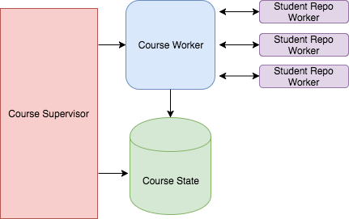

# How We Used Elixir's GenServers + Dynamic Supervisors to Build Concurrent, Fault Tolerant Workflows

"Concurrent" and "fault tolerant" are Elixir buzzwords that I heard again and again without actually seeing these features in action. Even after writing a fair amount of Elixir code, I still hadn't had an opportunity to meaningfully use them. So how _can_ we leverage native Elixir features to build programs that are concurrent and fault tolerant? What do we win by doing so?

In this post, we'll walk you through how to use GenServers and Dynamic Supervisors to build fast, concurrent workflows that are (you guessed it!) fault tolerant.

## The Problem

At the Flatiron School (you may have heard), we write a lot of curriculum content. That content lives in GitHub repos. In order to "deploy" that content to a class of students, we take the repos under a given GitHub organization that represents the course and copy them into a new organization that represents the class of students.

Something like:

* Give me all the repos under the "fullstack-web-immersive-curriculum" organization.
* Copy them into repos under the "fullstack-web-immersive-fall-2020" organization.

Taking _all_ of the repos that represent a given course and copying them over into a student organization can mean _a lot_ of GitHub API calls and Git interactions. Consequently, we're left with a program that is not only slowed down by a lengthy series of web requests, but made vulnerable to errors by the presence of so much code that relies on an external source (the GitHub API). Add to that the difficulty of tracking the success/failure of each individual "student repo deployment" and you're left with writing a lot of tricky and problematic code.

## Elixir To The Rescue

To solve our speed issue, we wanted something that would provide concurrency. To ensure that an error creating one student repo would be properly handled and not prevent the rest of the student repos from being created, we wanted something fault tolerant. Lastly, we wanted a tool that makes it easy to track the progress, success and failure of a given student repo and report on the overall state of the course's deployment to a class.

Elixir absolutely fit the bill. By leveraging Dynamic Supervisors and GenServers we can concurrently "deploy" lots and lots of repos, gracefully handle any errors that might occur for a given repo deployment and track each individual deployment process to be reported on later.

Keep reading to see exactly how we did it!

## GenServer Architecture

To build out our course deployment feature, we'll need the following constructs:

* `CourseState`: A GenServer that is responsible for tracking the progress of a given course's deployment to a class of student. It knows how many student repos are processing, which have completed successfully and which have failed.
* `CourseWorker`: A GenServer that orchestrates the deployment of a course. It knows _what_ steps are involved in the course deployment and when to kick off those steps. `CourseWorker` is in charge of spinning up the concurrent student repo workers.
* `StudentRepoWorker`: A GenServer that knows _what_ steps are involved in the creation of an individual student repo and _when_ to kick off those steps.
* `CourseSupervisor`: A Supervisor that will spin up the `CourseState` and `CourseWorker` servers in order to enact a course deployment.
* `StudentRepoSupervisor`: A Supervisor that will spin up `StudentRepoWorker` servers in order to enact the student repo creation process.

The relationship between these entities looks something like this:




The `CourseWorker` server tells the `StudenRepoWorkers` what to do and when to do it. And it passes messages back to the `CourseState` server at each step of the process.

Now that we have high-level overview of what we're building, let's dive in.

## Building the GenServer Infrastructure
We'll start by defining the `CourseState` and `CourseWorker` GenServers. Then we'll build a supervisor that knows how to start them up.

### The `CourseState` Server

This GenServer is pretty simple. It's not responsible for running any deployment-related code. It just holds the state of the course deployment. It should have awareness of:

* Which student repos are in the process of being created
* Which student repos have successfully been created
* Which student repos have failed

```elixir
defmodule CourseState do
  use GenServer

  def start_link(_args) do
    GenServer.start_link(__MODULE__, [])
  end

  def init(args) do
    {:ok,
      %{
        processing: [],
        success: [],
        failure: [],
        done: false
      }
    }
  end
```

Our server initializes without any arguments and it sets up an initial state that establishes awareness of the processing, successful and failed student repos. It also has awareness of whether or not the entire course deployment is done. We'll use this piece of info later on.

### The `CourseWorker` Server

This server is in charge of kicking off the individual student repo deployments and reporting on the progress of that work to the state server.

As such, it will initialize with some arguments:

* The params it needs to query for canonical repos to deploy to students.
* The PID of the `CourseState` server so that it can send messages to that server.

```elixir
defmodule CourseWorker do
  use GenServer

  def start_link([state_server_pid, course_params]) do
    GenServer.start_link(__MODULE__, [state_server_pid, course_params])
  end

  def init(args) do
    send(self(), :deploy_course)
    {:ok, }
  end

  def handle_info(:deploy_course, state) do
    # coming soon!
    {:noreply, state}
  end
end
```

Our `CourseWorker` server starts up by doing two things:

1. Storing the state server PID and course params in its _own_ internal state.
2. Kicking off the course deployment code flow (coming soon!)

Now that our first two GenServers have been born, let's build a supervisor to start them up.


### The `CourseSupervisor`

#### We Need a Dynamic Supervisor

Its important to understand that we _don't_ want our GenServers to start running when the application starts. We want our supervisor to spin up these GenServers for each "deploy a course" request that our app receives. So we need to start our supervisor when the app starts, _without starting the supervisor's children (the GenServers)_.

Luckily for us, Elixir allows us to do just that with [Dynamic Supervisors](https://hexdocs.pm/elixir/DynamicSupervisor.html)!

> A `DynamicSupervisor` starts with no children. Instead, children are started on demand via `start_child/2.`

In the following section we will:

* Define our very own Dynamic Supervisor.
* Tell our app to start this supervisor when the app starts.
* Teach our supervisor how and when to start its children.

#### Defining the Dynamic Supervisor

Our Dynamic Supervisor should know how to start both of its children with the arguments that they need.

```elixir
defmodule CourseSupervisor do
  use DynamicSupervisor

  def start_link(_arg) do
    DynamicSupervisor.start_link(__MODULE__, :ok, name: __MODULE__)
  end

  def start_work(course_params) do
    {:ok, state_pid}  = supervise_state_server
    supervise_worker_server(state_pid, course_params)
    {:ok, state_pid}
  end

  def init(:ok) do
    DynamicSupervisor.init(strategy: :one_for_one)
  end

  defp supervise_state_server do
    spec = %{id: CourseState, start: {DeployState, :start_link, []}}
    DynamicSupervisor.start_child(__MODULE__, spec)
  end

  defp supervise_worker_server(state_pid, course_params) do
    spec = %{restart: :temporary, id: CourseWorker, start: {CourseWorker, :start_link, [state_pid, course_params]}}
    DynamicSupervisor.start_child(__MODULE__, spec)
  end
end
```

Our supervisor implements a public-facing function, `start_work/1` that will take in the given course params and start the two child GenServers.

Let's take a closer look at the manner in which it starts up its children.

We tell the `CourseWorker` _not_ to restart in the event of a crash by specifying a `restart: temporary` scheme.

```elixir
%{restart: :temporary, id: CourseWorker, start: {CourseWorker, :start_link, [state_pid, course_params]}}
```

This is intentional. If the course deployment processes crashes, we can let it crash. We've stored the _state_ of the course deployment in a different GenServer entirely, the `CourseState` server. This server will still be up and running in the event of such a crash. It can report on the status of the course deployment to the client, who can decide if and how to try again.

Further, the `CourseWorker` GenServer is not meant to be a long-running process. The supervisor starts up one such process for each course deployment. Once a course is successfully deployed to a class of students, we will terminate the GenServer process. We _don't_ want our supervisor to continue to restart such processes.

The state server, on the other hand, should be restarted if it crashes, so we do not specify a "temporary" restart value.

Now that our supervisor knows how to start its children, let's teach the app to start our supervisor.

#### Starting the Dynamic Supervisor

We want our dynamic supervisor to start up when the app starts, so we'll add the following to our `application.ex` file:

```elixir
# application.ex

...
def start(_type, _args) do
  import Supervisor.Spec
  children = [
    supervisor(Curriculum.Repo, []),
    %{
      id: Curriculum.CourseSupervisor,
      start: {Curriculum.CourseSupervisor, :start_link, [[]]}
    }
  ]
  opts = [strategy: :one_for_one, name: Curriculum.Supervisor]
  Supervisor.start_link(children, opts)
end
```

#### Starting the GenServers

Now that our supervisor is up and running, we can tell it to execute a course deployment by starting its children like this:

```elixir
CourseSupervisor.start_children(course_params)
```

Our app can call on this code whenever it receives a request to deploy a course to a class of students.

### Executing a Course Deployment
Now that our GenServers know how to get up and running, let's take a close look at what they actually _do_.

Deploying a course involves two steps:

1. Query for all of the "canonical" repos that need to be made into student repos
2. Spin up a concurrent process to create each student repo.

We want to maintain separation of concerns. So, we don't want the `CourseWorker` GenServer to know _how_ to perform each of these steps. It will simply tell a helper module, `CourseDeployer` _what_ to do. And, at each step of the process it will update the state server with the necessary info.

First, `CourseWorker` will tell `CourseDeployer` to query for the repos and start up the student repo creation process. It will pass `CourseDeployer` its own PID so that `CourseDeployer` can send messages back to this worker GenServer, which will in turn tell the `CourseState` server to make any necessary changes to state.

```elixir
# course_worker.ex

def handle_info(:deploy_course, state) do
  state[:course_params]
  |> CourseDeployer.deploy_student_repos(worker_pid)
  {:noreply, state}
end
```

This separation of concerns has an added benefit: If the code invoked by `CourseDeployer` raises a Run Time error, it will cause the `CourseWorker` that called on it to crash in in a way that we can listen for and handle appropriately. More on that later.

Let's take a closer look at the `CourseDeployer.deploy_student_repos/1` function. this function runs the query for canonical repos to deploy, iterates over the results and tells the `StudentRepoSupervisor` to start a child process for reach student repo to create.

For each student repo deploy process it kicks off, `CourseDeployer` then sends a message _back_ to the `CourseWorker` with the PID of that process.

```elixir
# course_deployer.ex
defmodule CourseDeployer do

  def deploy_student_repos(course_params, worker_pid) do
    CourseDeployments.repos_for_course(course_params)
      |> Enum.map(&deploy_student_repo(&1, worker_pid))
      |> Enum.map(&update_processing_state(&1, worker_pid))
  end

  def deploy_student_repo(canonical_repo, worker_pid) do
    {:ok, pid} = StudentRepoSupervisor.start_work(canonical_repo, worker_pid)
    pid
  end

  def update_processing_state(student_repo_pid, worker_pid) do
    CourseWorker.update_processing_state(student_repo_pid, worker_pid)
  end
end
```

`CourseWorker` will pass this message along to the state server which will update the `:processing` key in state to point to an list that includes the new student repo worker PID.

```elixir
# course_worker.ex

def update_processing_state(student_repo_pid, worker_pid) do
  GenServer.cast(worker_pid, {:update_processing_state, student_repo_pid})
end

def handle_cast({:update_processing_state, student_repo_pid}, state) do
  state[:state_server_pid]
  |> CourseState.update_processing(student_repo_pid)
  {:noreply, state}
end
```

The `CourseState` server receives the `update_processing` message and responds by updating its internal state.

```elixir
# course_state.ex

def update_processing(state_server_pid, student_repo_pid) do
  GenServer.cast(state_server_pid, {:update_processing, student_repo_pid})
end

def handle_cast({:update_processing, student_repo_pid}, state) do
  processing = state[:processing]
  state      = Map.put(state, :processing, [student_repo_pid | processing])
  {:noreply, state}
end
```

Now that we've kicked off the course deployment process, we can see the pattern of communication that is starting to emerge:

* A supervisor starts its child servers.
* A "worker" server tells a module to do some work.
* The module doing the work sends messages back to the worker server.
* The "worker" server tells its sibling "state" server to make changes to state.

Now let's switch gears and take a look at the concurrent work that our `StateRepoSupervisor` kicks off for us.

## Building Concurrency


### The `StudentRepoSupervisor`

If we want to dynamically start a GenServer process responsible for creating each individual student repo, we need a dynamic supervisor.

We'll define a supervisor, `StudentRepoSupervisor`:

```elixir
# student_repo_supervisor.ex

defmodule StudentRepoSupervisor do
  use DynamicSupervisor
  def start_link(_arg) do
    DynamicSupervisor.start_link(__MODULE__, :ok, name: __MODULE__)
  end

  def init(:ok) do
    DynamicSupervisor.init(strategy: :one_for_one)
  end

  def start_work(canonical_repo, course_worker_pid) do
    spec = %{id: StudentRepoWorker, start: {StudentRepoWorker, :start_link, [[canonical_repo, course_worker_pid]]}, restart: :temporary}
    DynamicSupervisor.start_child(__MODULE__, spec)
  end
end
```

This supervisor has one child: `StudentRepoWorker`. This will be a GenServer responsible for the "create a student" repo work. Notice that this child has a `:temporary` restart strategy. Once again, if the individual worker process crashes, we _don't_ want to restart it. We are maintaining out state server separately. A worker process crash _won't_ kill our state server, and we can retrieve our state from that server and act on it in the event of such a crash.

Further, the `StudentRepoWorker` GenServer is not meant to be a long-running process. The supervisor starts up one such process for each student repo deployment. Once a student repo creation is finished running, we will terminate the GenServer process. We _don't_ want our supervisor to continue to restart such processes.

Let's make sure our new dynamic supervisor is started with the app starts:

```elixir
# application.ex

...
def start(_type, _args) do
  import Supervisor.Spec
  children = [
    supervisor(Curriculum.Repo, []),
    %{
      id: CourseSupervisor,
      start: {CourseSupervisor, :start_link, [[]]}
    },
    %{
      id: StudentRepoSupervisor,
      start: {StudentRepoSupervisor, :start_link, [[]]}
    }
  ]
  opts = [strategy: :one_for_one, name: Curriculum.Supervisor]
  Supervisor.start_link(children, opts)
end
```

Now we're ready to take a closer look at this supervisor's child, the `StudentRepoWorker` GenServer.

### The `StudentRepoWorker` Server

This worker is responsible for enacting the "create a student repo" process.

It will tell another helper module, `StudentRepoDeployer` to make the student repo in GitHub.

If this process succeeds, it will pass a message back to the `CourseWorker`, which will tell the `CourseState` server to update state.

If the process fails, it will pass a message back to the `CourseWorker`, which will tell the `CourseState` server to update state.

#### Executing Student Repo Deployment

When our GenServer starts, it receives an arguments of the canonical repo (which will be used to create a student repo), along with the PID of the course worker server. It will use this PID to send messages back to that server. It stores both of these things in its own internal state for later use.

```elixir
defmodule StudentRepoWorker
  use GenServer

  def start_link([canonical_repo, course_worker_pid]) do
    GenServer.start_link(__MODULE__, [canonical_repo, course_worker_pid])
  end

  def init([canonical_repo, course_worker_pid]) do
    send(self(), :deploy_student_repo)
    {:ok,
      %{
        canonical_repo: canonical_repo, course_worker_pid: course_worker_pid
      }
    }
  end

  def handle_info(:deploy_student_repo, state) do
    StudentRepoDeployer.deploy_student_repo(state[:canonical_repo, self()])
    {:noreply, state}
  end
end
```

When the GenServer starts, it sends the `:deploy_student_repo` message. Our server responds to that message by calling on the `StudentRepoDeployer` helper module. This is the module that knows how to create student repos. Our server passes its own PID to the helper module so that the module can send messages back to the server when a repo has finished deploying.

`StudentRepoDeployer` creates the new GitHub repo and passes the message regarding the success or failure of this process back to the `StudentRepoWorker` process.

```elixir
defmodule StudentRepoDeployer do
  def deploy_student_repo(canonical_repo, student_repo_worker_pid) do
    case do_repo_student_deploy(canonical_repo) do
      {:ok, student_repo} ->
        StudentRepoWorker.success(student_repo_worker_pid, student_repo)
      {:error, error} ->
        StudentRepoWorker.failure(student_repo_worker_pid, error)
    end
  end
end
```

Our `StudentRepoWorker` GenServer handles this message by passing it along to the `CourseWorker` server (whose PID it stored in state), _and then dying_. Once the work of creating a student repo is done, this proces can terminate. So, we have our `handle_cast` functions respond with the `:stop` message. This tells the process to die.

```elixir
# student_repo_worker.ex

def success(student_repo_worker_pid, student_repo) do
  GenServer.cast(student_repo_worker_pid, {:success, student_repo})
end

def failure(student_repo_worker_pid, error) do
  GenServer.cast(student_repo_worker_pid, {:failure, error})
end

def handle_cast({:success, student_repo}, state) do
  state[:course_worker_pid]
  |> CourseWorker.student_repo_success(student_repo, self())
  {:stop, :done, state}
end

def handle_cast({:failure, error}, state) do
  state[:course_worker_pid]
  |> CourseWorker.student_repo_failure(error, self())
  {:stop, :done, state}
end

def terminate(:done, _state), do: :ok
```

Our `CourseWorker` will receive the student repo success/failure messages from each individual `StudentRepoWorker` that is running. It will respond by telling the `CourseState` server to update appropriately.

Then, it performs an important next step. It checks the `CourseState` server's internal state to see if there are any student repo workers still processing. If not, then we are done deploying the course! Our `CourseWorker` will tell the state server to update its state to set `:done` to `true`. Then it will terminate itself.

```elixir
# course_worker.ex

def student_repo_success(course_worker_pid, student_repo, student_repo_worker_pid) do
  GenServer.cast(course_worker_pid, {:student_repo_success, student_repo, student_repo_worker_pid})
end

def student_repo_failure(course_worker_pid, error, student_repo_worker_pid) do
  GenServer.cast(course_worker_pid, {:student_repo_failure, error, student_repo_worker_pid})
end

def handle_cast({:student_repo_success, student_repo, student_repo_worker_pid}, state = %{state_server_pid: state_server_pid}) do
  state_server_pid
  |> CourseState.update_success_state({:success, student_repo, student_repo_worker_pid})

  course_state = CourseState.get_state(state_server_pid)

  if Enum.any?(course_state[:processing]) do
    CourseState.done(state_server_pid)
    {:stop, :done, state}
  else
    {:noreply, state}
  end
end

def handle_cast({:student_repo_failure, error, student_repo_worker_pid}, state = %{state_server_pid: state_server_pid}) do
  state_server_pid
  |> CourseState.update_failure_state({:failure, error, student_repo_worker_pid})

  course_state = CourseState.get_state(state_server_pid)

  if Enum.any?(course_state[:processing]) do
    CourseState.done(state_server_pid)
    {:stop, :done, state}
  else
    {:noreply, state}
  end
end

def terminate(:done, _state), do: :ok
```

Our `CourseState` server knows how to respond to the "success", "failure" and "done" messages. It handles student repo success/failure messages by removing the student repo worker PID from the `:processing` key in state and updating the `:success` or `:failure` buckets appropriately. `CourseState` also knows how to expose its state via the `get_state/1` function.

It responds to the "done" message by updating the `:done` key to `true`. This state server _doesn't_ terminate itself like the other GenServers do when they are done working. We'll come back to the question of how to act on this "done" state shortly.

```elixir
# course_state.ex

def get_state(state_server_pid) do
  GenServer.call(state_server_pid, :get_state)
end

def update_success_state(state_worker_pid, {:success, student_repo, student_repo_worker_pid}) do
  GenServer.cast(state_worker_pid, {:success, student_repo})
end

def update_failure_state(state_worker_pid, {:failure, error, student_repo_worker_pid}) do
  GenServer.cast(state_worker_pid, {:failure, error})
end

def done(state_worker_pid) do
  GenServer.cast(state_worker_pid, :done)
end

def handle_call(:get_state, _from, state) do
  {:reply, state}
end

def handle_cast({:success, student_repo}, state) do
  # remove the student_worker_pid from the :processing key of state
  # put the student repo under the :success key of state
  {:noreply, state}
end

def handle_cast({:success, error}, state) do
  # remove the student_worker_pid from the :processing key of state
  # put the error under the :failure key of state
  {:noreply, state}
end

def handle_cast(:done, state) do
  state = Map.put(state, :done, true})
  {:noreply, state}
end
```
## Adding Fault Tolerance

Now that our course deployment flow is built out (and concurrent to boot), let's talk about fault tolerance. If a given `StudentRepoWorker` crashes, we need to tell `CourseWorker` to tell `CourseState` to move that PID to the error bucket.

We can leverage a custom GenServer `terminate` function to do just that. The `GenServer.terminate/2` function is a callback that gets invoked automatically when the GenServer stops running.

If `StudentRepoWorker` receives an unexpected termination, we'll pass a message to `CourseState` to make the appropriate updates.

```elixir
# student_repo_worker.ex

def terminate(reason, state) do
  state[:course_worker_pid]
  |> CourseWorker.student_repo_failure(reason, self())
  :ok
end
```

`CourseWorker` already knows how to handle this `student_repo_failure` message by passing it along to `CourseState`.

If the `CourseWorker` server crashes, however, we can't continue to process _any_ student repo deployments. This is because each individual student repo worker would be trying to send messages to a `CourseWorker` PID that is not alive. In that case, we need to tell `CourseState` that the course deployment is done and that any student repo worker PIDs remaining in the `:processing` bucket should be moved to `:failed`.

```elixir
# course_worker.ex

def terminate(reason, state) do
  state[:state_server_pid]
  |> CourseState.course_failed(reason)
  :ok
end
```

```elixir
# course_state.ex

def course_failed(state_server_pid, error_message) do
  GenServer.cast(state_server_pid, :course_failed)
end

def handle_cast(:course_failed, state) do
  processing = state[:processing]
  failed     = state[:failed]
  state      = Map.merge(state, %{processing: [], failed: failed  <> processing, done: true})
  {:noreply, state}
end
```

Now, if either of our worker GenServers crash, we'll be sure to appropriately update the state server. We'll retain awareness of the state of a course deployment if that deployment crashes or errors and be able to reflect that state to the client.

## Finishing a Course Deployment

We know that when we have no more PIDs in the `:processing` bucket in state, we mark state as "done". By this time, we will have terminated the worker GenServers. But our state server is still running, still holding on to state.

We need some code that can check if the state is "done", retrieve the state for the client, and terminate the state server.

We kick off our course deployment process by telling our `CourseSupervisor` to start its children. We defined the `start_work/1` function such that it will return the pid of the `CourseState` server:

```elixir
{:ok, state_server_pid} = CourseSupervisor.start_work(course_params)
```

Since we have the state server's PID, we can poll the server to see when the `:done` key is set to true:

```elixir
def deploy_course(course_params) do
  {:ok, state_server_pid} = CourseSupervisor.start_work(course_params)
  course_deployment_finished?(state_server_pid)
end

def course_deployment_finished?(state_server_pid) do
  state = CourseState.get_state(state_server_pid)
  if !state[:done] do
    poll_course_state(state_server_pid)
  else
    CourseState.shutdown(state_server_pid)
    state
  end
end
```

We'll teach `CourseState` how to stop a given process:

```elixir
# course_state.ex

def shutdown(state_server_pid) do
  GenServer.stop(state_server_pid)
end
```

If the course deployment is done, we'll return the state from the state server and terminate the server. Otherwise, we'll keep polling. Then, we can take the state we returned above and use it to update our client--via a response to a web request or some other mechanism.

## What We Won

By leveraging Dynamic Supervisors, we gave our app the ability to start and stop GenServers as-needed, such as in response to receiving a request to deploy a given course to students.

In this manner, we can tell one GenServer to start a concurrent set of server processes--one for each student repo creation process. This sped up what had the potential to be a very slow, sequential set of work.

Not only did our Dynamic Supervisor/GenServer architecture allow for concurrent workflows, it provided us a way to build fault tolerance into those workflows. We separated out the work of managing the deployment of the entire course from the work of creating an individual student repo *and* we separated out the state tracking mechanism from both of these pieces of work. That meant that we could catch errors or crashes in a given worker process, ensure that any such errors didn't effect the processing of the other student repos, *and* update the separate state management system appropriately.

All in all, we created a fast and resilient system to enact a critical process for our organization.
